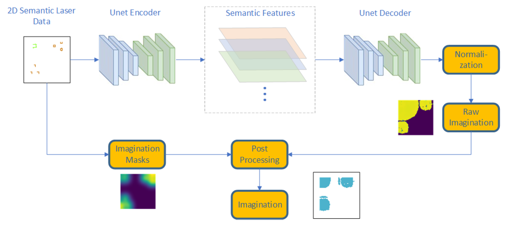
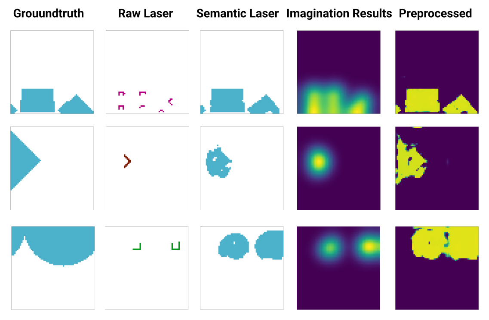

### Model

#### **2D semantic anticipator**

### Requirements

* SemAnt2D (already integrated, see ```./rl/semantic_anticipator.py```)
* PyTorch
* TensorBoard | TensorFlow
* OpenCV

### How to run

* Run the script ```./example/examples2.py```.

### Detailed structure of the imagination unit

The imagination unit consists of an Unet encoder, an Unet decoder, the imagination mask generator, and the post-processing unit. The input data, 2D semantic laser data will first go through the Unet. The raw imagination output, combined with an input-based imagination mask will be then forwarded to the post-processing module for the final result.

<p align="center">
   
</p>

### Imagination results

The following image shows imagination results together with ground truth image, laser scan, semantic laser scan, preprocessed mask, and imagination result for different example local areas.

<p align="center">
   
</p>
